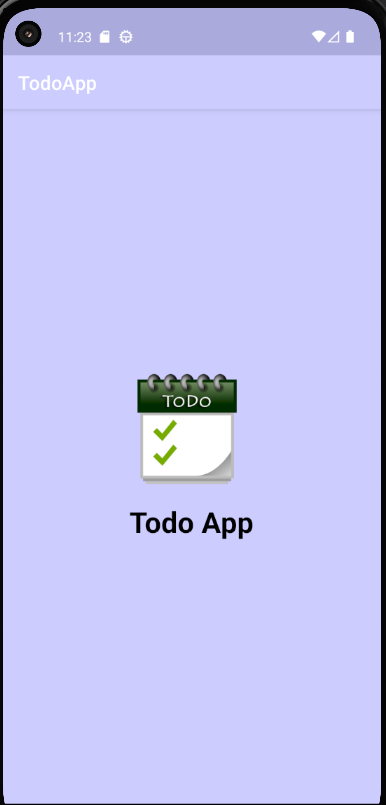
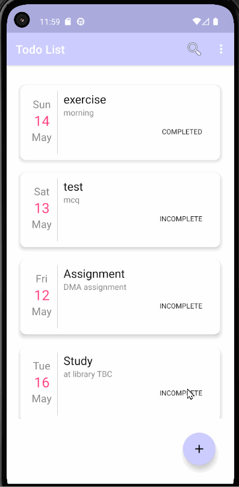
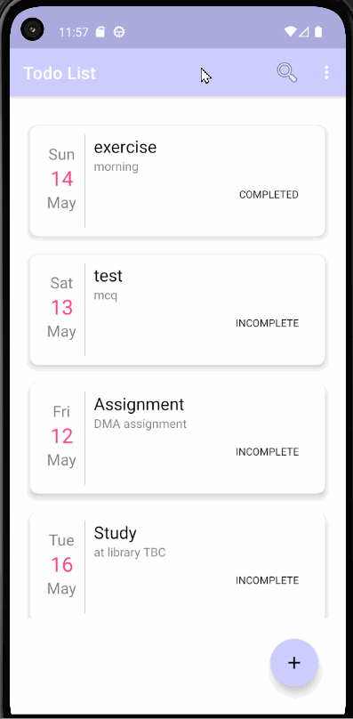
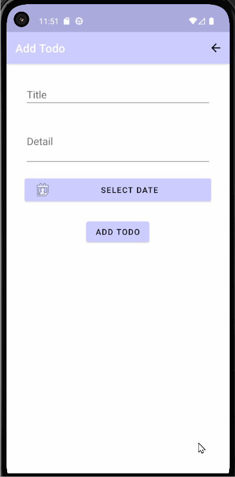
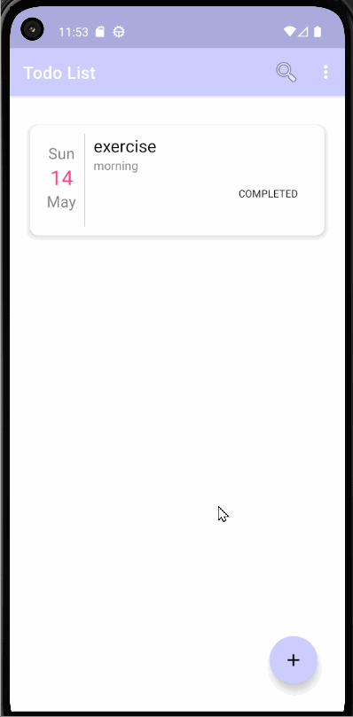
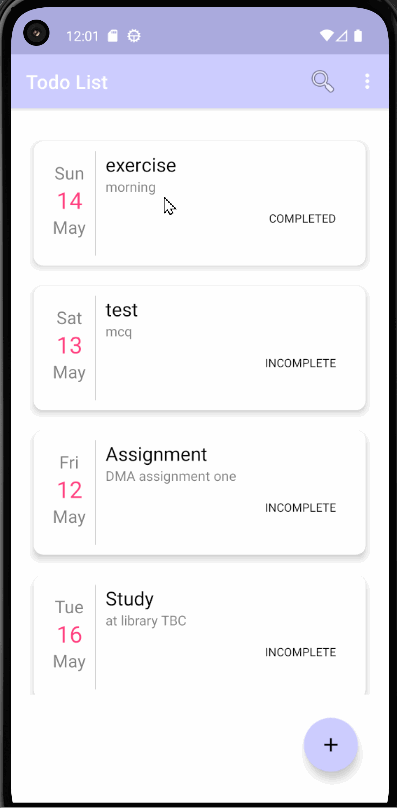
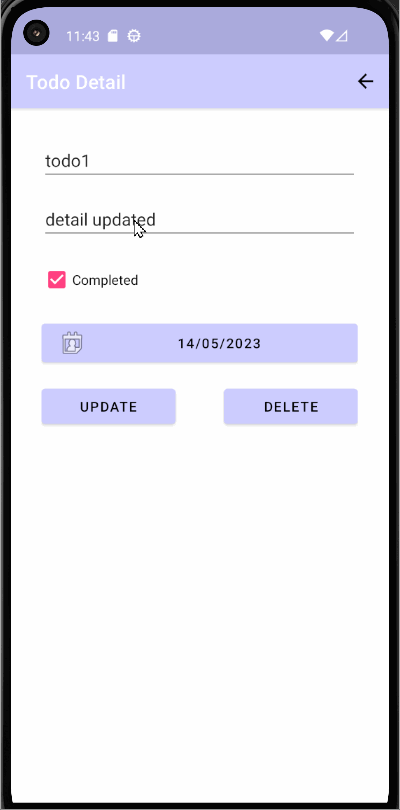
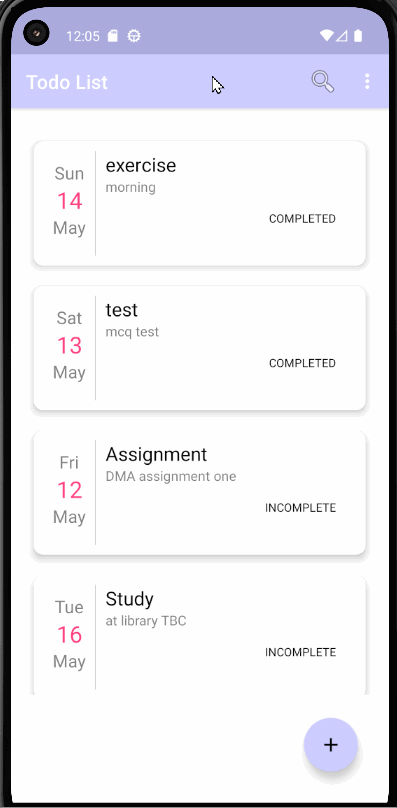
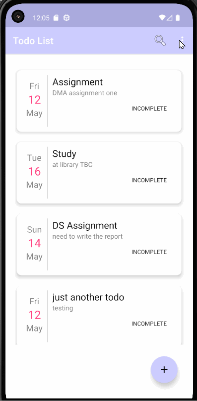
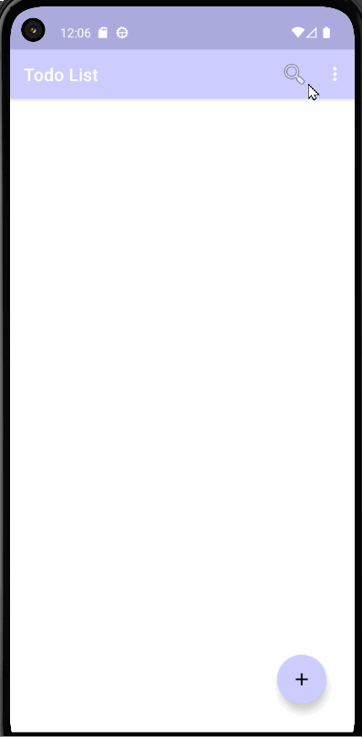

# Todo App 

A todo app written in java using the fragments, Components, MVVM, persistance, manifest, activity, view objects, lifecycle, listeners, anonymous functions, event handlers, callbacks, bundle and resources. User can easily create, update, manage, and organize todos in one place for specific date and can view thier status whether it is completed or not (status needs to be updated manually). 

## UI Design
### Application Icon  
Application icon seen while installing or after installed

 

### Splash Screen 
The Screen that the user sees while opening the app before the homescreen.
 

### Navigation
Can navigate back to the previous page.
  
  

### Recycler View
Can view and scroll through the list.
  

### Add Task 
Can add the todo by filling the required fields.
  

### Validation
Fields can't be empty.

### Update Task
Can update todo by updating required fields.
  

### Delete Current Todo
Can delete current todo.
  

### Delete Completed Todos
Can delete all todos having status completed.
 

### Delete All Todos
Can delete all the available todos.
  

### About
Can view the details of the App and author's name.
 

## Basic Features

These are the basic functional requirements of our App that helps to do perform these mentioned features.

- Display Todo List
- Add Todo
- Update Todo
- Delete Todo
- Show Todo Status (Completed / Incomplete)

## Additional Features

These are the Non- functional requirements added on the Application to make it more real-world application.
 
- Splash Screen
- Application Icon
- Navigation Button
- Delete All
- Delete Completed
- Search Todo
- Validation 

## Author

- [Bibash Chaudhary](https://github.com/bibash77261081/Todo-App)

## References
- [Binay Shah](https://github.com/binay-shah/TodoMVVM_b)

